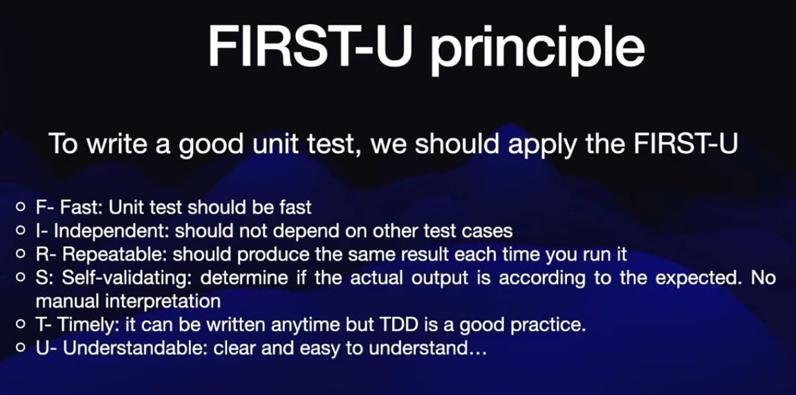

# Unit testing with Jest in Typescript

## Initialize a Node project

```bash
npm init -y
```

```json
{
  "name": "unit-testing",
  "version": "1.0.0",
  "description": "Unit testing with Jest in Typescript",
  "main": "index.js",
  "scripts": {
    "test": "echo \"Error: no test specified\" && exit 1"
  },
  "author": "Leonardo José Nunes",
  "license": "MIT"
}
```

## Add Dev Dependencies
```bash
npm i -D jest typescript ts-jest @types/jest
```

```json
{
  "name": "unit-testing",
  "version": "1.0.0",
  "description": "Unit testing with Jest in Typescript",
  "main": "index.js",
  "scripts": {
    "test": "echo \"Error: no test specified\" && exit 1"
  },
  "author": "Leonardo José Nunes",
  "license": "MIT",
  "devDependencies": {
    "@types/jest": "^29.5.13",
    "jest": "^29.7.0",
    "ts-jest": "^29.2.5",
    "typescript": "^5.6.2"
  }
}

```

## Configure Jest
```bash
npx ts-jest config:init
```

This creates jest.config.js // but we want to use Typescrcipt

```javascript
/** @type {import('ts-jest').JestConfigWithTsJest} **/
module.exports = {
  testEnvironment: "node",
  transform: {
    "^.+.tsx?$": ["ts-jest",{}],
  },
};
````

Delete autoconfig and create mannualy 

jest.config.ts

```typescript
import type { Config } from "@jest/types";

const config: Config.InitialOptions = {
  preset: "ts-jest",
  testEnvironment: "node",
  verbose: true,
};

export default config;
```

## Add ts-node
```bash
npm i -D ts-node
```

## Create ts config

```bash
npm install -g typescript
tsc --init
```
tsconfig.json
```json
{
  "compilerOptions": {
   "esModuleInterop": true,                             
  }
}
```

package.json
```json
{
  "name": "unit-testing",
  "version": "1.0.0",
  "description": "Unit testing with Jest in Typescript",
  "main": "index.js",
  "scripts": {
    "test": "jest"
  },
  "author": "Leonardo José Nunes",
  "license": "MIT",
  "devDependencies": {
    "@types/jest": "^29.5.13",
    "jest": "^29.7.0",
    "ts-jest": "^29.2.5",
    "ts-node": "^10.9.2",
    "typescript": "^5.6.2"
  }
}

```

# Test Structure




## Test Coverage

jest.config.ts
```json
import type { Config } from "@jest/types";

const config: Config.InitialOptions = {
  preset: "ts-jest",
  testEnvironment: "node",
  verbose: true,
  collectCoverage: true,
  collectCoverageFrom: ["<rootDir>/src/app/**/*.ts"],
};

export default config;
```

.gitignore
```txt
/node_modules
/coverage
```

```bash
firefox "./coverage/lcov-report/index.html"
```